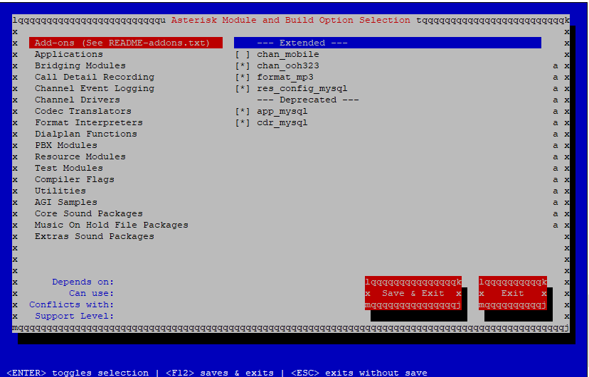
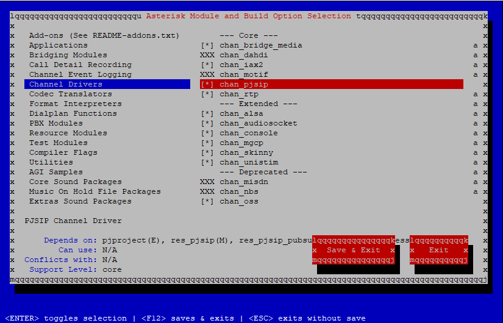

  
## 🚀  Passo 1 - Instação Asterisk - Passo a Passo / Documentação.


Instalação do asterisk irá  ser no nosso querido CentOS7 

Vamos efetuar atualização do CentOS  

```bash
yum update all
 ```

Obs: Esse processo irá levar pelo menos uns 10minutos dependedo da conexão que você estiver utilizando, vá tomar um café.

Após conclusão vamos reniciar o sistema

```bash
sudo reboot
```

Agora vamos lá instalar mais uma caralhada de epel para não dar problema lá na frente (serio já deixei de instalar isso já deu  uns alguns bugs inexplicável)

```bash
yum install -y epel-release
```

Vamos instalar uma porrada de dependecia. 

```bash
yum install -y wget vim net-tools openssl-devel libedit-devel sqlite-devel psmisc gmime-devel ncurses-devel libtermcap-devel sox newt-devel libxml2-devel libtiff-devel audiofile-devel gtk2-devel uuid-devel libtool libuuid-devel subversion kernel-devel kernel-devel-$(uname -r) git subversion
```


Uffa... acabou aí né, mas calma tem mais, porque agora vamos instalar o “Development  Tools”, isso porque não começamos nem instalar o asterisk =)

```bash
yum groupinstall -y “Development tools”
```

Apartir daqui vamos para alguns passos importantes antes da instalação do asterisk.


Aqui vamos fazer Download, Instalação e Compilação do Jansson, parece dificil mais é fácil fica de boa..

O Jansson é uma biblioteca em C para manipulação de JSONs e também é um pré-requisito para a compilação do Asterisk, sendo assim, vamos começar por ele, fazendo o download através do git.

Antes disto, para manter organizado, se dirija para o diretório /usr/src 

```bash
cd /usr/src
```
agora acabou o blá blá, vamos por a mão na massa ou no teclado, como você quiser, vamos fazer um clone do projeto que tem lá no GIT dos manos: 

```bash
git clone https://github.com/akheron/jansson.git
```

Para fazer o clone é rapidinho, normalmente não é para ser demorado não, apos efetuar o clone do jansson, bora entrar no diretorio dele.

```bash
cd jansson
```
Agora execute os seguintes comandos, mano pelo amor do bom JÉSUS **UM DE CADA VEZ MAN**, SEM PRESSA.

```bash
autoreconf -i

./configure –prefix=/usr/

make

make install
```

Foi suavão né... bora que tem coisa para um bagual, partiu instalar o PJSIP.
O PJSIP funciona no Asterisk mas não é nativo do código fonte dele, sendo assim, precisamos instalar/compilar ele ANTES do Asterisk para que possa funcionar, com isto, bora lá!

Primeiro, vamos baixar o PJ SIP, entre no diretorio /usr/src

```bash
cd /usr/src
```

Bora para mais download.

```bash
wget -c https://github.com/pjsip/pjproject/archive/2.8.tar.gz
```

Descompacte o PJSIP

```bash
tar zxvf 2.8.tar.gz
```

Entre no diretório do PJSIP

```bash
cd pjproject-2.8
```

Mano, agora vamos fazer isso na manciota.. novamente um de cada vez, sem pressa aprecie o momento com um bom LO-FI de musica.

```bash
./configure CFLAGS=”-DNDEBUG -DPJ_HAS_IPV6=1″ –prefix=/usr –libdir=/usr/lib64 –enable-shared –disable-opencore-amr

make dep

make

make install

ldconfig
```

Ae até quem enfim chegamos na instalação do Asterisk sem o oblix é claro, bora lá, aqui eu vou utilizar o Asterisk 18 LTS(Sempre que forem instalar alguma versão do asterisk utilize as LTS pois são versao final, Com as grande parte dos bugs corrigidos.)
Partiu para o que interessa.

```bash
cd /usr/src
```
(Para sempre manter o padrão de downloads, já sabem né, se mudar a cor da grama "nois" não come.)

```bash
wget -c http://downloads.asterisk.org/pub/telephony/asterisk/asterisk-18-current.tar.gz
```
Extraia o asterisk

```bash
tar zxvf asterisk-18-current.tar.gz
```

No meu caso a versão baixada é Asterisk 18.6  (LTS), Mas pode ser qualquer versão desde que seja LTS
```bash
cd asterisk-18.6.0
```

Bora dar start a instalação do nosso amguinho que poucos gostam e muitos odeiam.

```bash
./configure –libdir=/usr/lib64
```

Calma já está quase pronto, a instalação do bang...  tenha uma pouco mais de calma.
Agora está o pulo de gato e é necessário fazer algumas ativações verificações antes de continuar. 

```bash
make menuselect
```
Selecione todas essas paradinhas no menuselect.



o mais importante que vamos habilitar nessa tela é o "format_mp3"  e caso voce tenha necessidade de usar MySQL habilite o **res_config_mysql** e o **cdr_mysql** (Como é o caso da grande maioria) 


Em “Channel Drivers” se certifique de que **chan_pjsip** esteja marcado:



Deixa igual está ai... agora TAB 2 vezes até chegar em **"SAVE & EXIT"-**

Agora vamos entrar na reta final!!! uffa!.. O negocinho demorando para fazer. 
vamos compilar e instalar,Bom acho que eu nao preciso comentar mas já vou frizando para os esquecidinhos de plantão é **UM COMANDO DE CADA VEZ** !!!! 

```bash
make
contrib/scripts/get_mp3_source.sh

make install

make config

make samples
```

O “make config” adicionar os scripts para o systemctl / init.d e o “make samples” tras os arquivos de configuração com exemplos para o diretório /etc/asterisk.

Aee!!!! Uhullll finalizado 

agora vamos da a primeira inicializada no nosso garotão...

```bash
systemctl start asterisk
```

Agora vamos colocar para inicializar automatico né pai, porque se a maquina reniciar sozinha não precisamos ficar dando start toda vez que o SO reniciar. 

```bash
systemctl enable asterisk
```

Se você seguiu o tutorial certinho é para está tudo funcionando =)


```bash
 systemctl status asterisk
```

```bash
● asterisk.service - LSB: Asterisk PBX
   Loaded: loaded (/etc/rc.d/init.d/asterisk; bad; vendor preset: disabled)
   Active: active (running) since Wed 2021-10-06 16:09:25 -03; 17h ago
     Docs: man:systemd-sysv-generator(8)
  Process: 19195 ExecStop=/etc/rc.d/init.d/asterisk stop (code=exited, status=0/SUCCESS)
  Process: 19223 ExecStart=/etc/rc.d/init.d/asterisk start (code=exited, status=0/SUCCESS)
 Main PID: 19252 (asterisk)
   CGroup: /system.slice/asterisk.service
           ├─19250 /bin/sh /usr/sbin/safe_asterisk
           └─19252 /usr/sbin/asterisk -f -vvvg -c

```


Instalação ta feita ai man =) 


